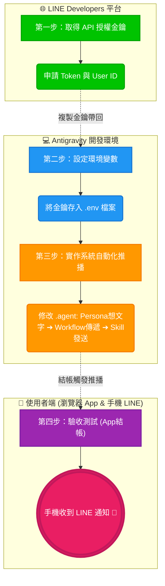
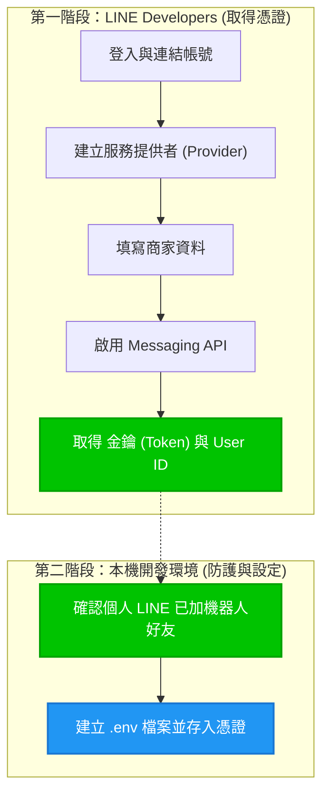
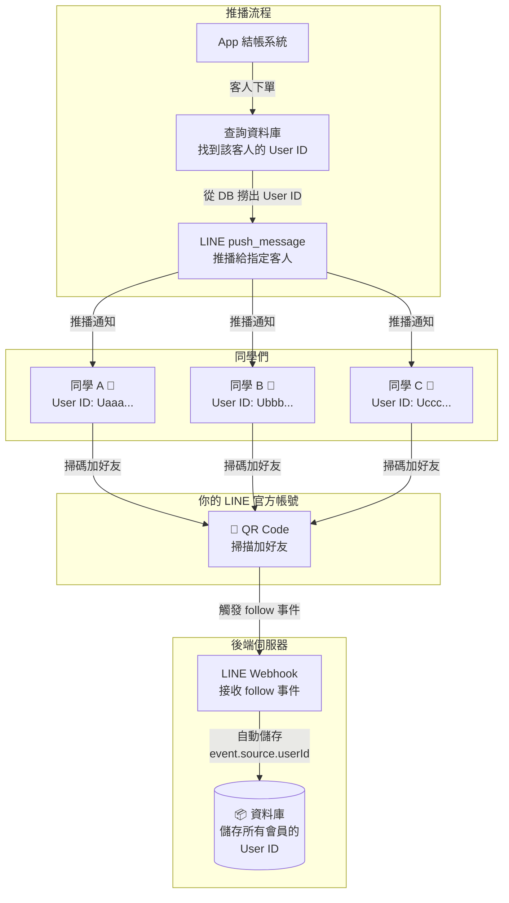

# ch06 - 天下茶屋：讓你的 App 會發 LINE 訊息！


## 課程大綱

| 階段       | 系統實作目標               | 技術實踐與學習重點                                   |
| :--------- | :------------------------- | :--------------------------------------------------- |
| **第一步** | **取得 API 授權金鑰**      | 申請與配置 LINE Messaging API Channel Access Token |
| **第二步** | **組態環境變數與資安防護** | 建立 `.env` 環境變數以安全管理系統機密憑證           |
| **第三步** | **實作系統自動化推播**     | 整合 LINE MCP 伺服器，實作訂單成立後自動觸發推播邏輯 |

### 🗺️ 今日實作流程圖



---

# Part 1 · 觀念小教室

### 使用 Messaging API

你可以把它想成是一個「自動推播系統」：系統主動把訊息推送到客人手機的 LINE！

### 💰 2026 費用說明（重要！）

| 方案 | 月費 | 每月免費額度 | 適合對象 |
| :--- | :--- | :--- | :--- |
| **輕用量** | $0 | **200 則** | 學生練習、小型測試 ✅ |
| 中用量 | $800 | 3,000 則 | 小型店家 |
| 高用量 | $1,200 | 6,000 則 | 中大型企業 |

> [!IMPORTANT]
> - **Push API**（系統主動推送）= **會扣額度，用完不會自動扣款，直接停止服務**，本課程實作。
> - **Reply API**（用戶先說話，Bot 再回覆）= **完全免費**，實務上應優先使用！
> - Token 外洩 → 額度瞬間歸零，務必存入 `.env` 保管。

### 🔐 為什麼需要 .env 檔案？ (資安防護的核心)

如果說程式碼是專案的 **「佈告欄」**（大家都能看到），那 `.env` 檔案就是專案的 **「環境變數設定檔」**。

在開發專業系統時，`.env` 主要有以下三個作用：

1. **隱藏祕密 (Security)**：
   - 像 API 金鑰 (Token) 這種「授權憑證」，一旦寫在 Markdown 或程式碼中並上傳，全世界的駭客都能盜用你的額度。放在 `.env` 裡，系統會讀取它，但外人看不見它。
2. **環境分離 (Portability)**：
   - 程式邏輯（怎麼點餐）是不變的，但「測試環境」與「正式環境」的金鑰可能不同。透過 `.env`，我們不需要改動任何一行程式，只需要換掉設定檔裡的「金鑰」就能切換環境。
3. **標準化開發**：
   - 常見開發者的做法。當別的工程師接手你的專案時，看到 `.env` 就知道哪裡可以設定系統連線資訊，不需要大海撈針去翻程式碼。

**總結：** 程式碼負責「怎麼做 (How)」，`.env` 負責「用誰的帳號做 (Who)」。兩者分開存放，才是專業開發者的做法！

### 任務目標

讓 AI 在你「結完帳」的那一刻，主動發 LINE 到你手機：『您的飲品製作中！』。

---

# Part 2 · 工具準備（取得 API 金鑰與設定環境變數）

## 2.1 申請 LINE API 金鑰 (商家機器人身分設定)

這一步是為了取得 **「商家機器人」的授權金鑰**。我們要拿到一串密鑰，讓系統能代表「天下茶屋」這間店發送訊息給客人。請依照以下簡單步驟取得金鑰：

### 🗺️ Part 2 操作流程導覽



1. **登入網站**：打開 [LINE Developers 控制台](https://developers.line.biz/console/)。「LINE Business ID」畫面中，請點擊「Line 帳號」以連動你的個人帳號進行登入（以你的帳號模擬商家帳號）。
2. **第一步：連結帳號**：系統會要求進行「簡訊認證」，請輸入手機號碼並填寫驗證碼。
3. **第二步：建立服務提供者(Provider)**：驗證通過後進入表單，請依照建議填寫：
   - **Create a new provider**：建立一個新的商家，建議填寫 `天下茶屋`。
   **第三步：填寫商家資料**：
   - **帳號名稱**：建議填寫 `天下茶屋_你的姓名`。
   - **電子郵件**：填寫你的常用 Email。
   - **業種**：大類選「餐飲」，小類選「冰品、飲料」。
   - 確認內容後點選「確定」即可完成建立。
   - **重要防呆**：建立後若詢問「是否申請認證官方帳號」，請選擇 **「稍後進行認證（前往管理畫面）」**，直接進入 LINE Official Account Manager 管理後台即可。
4. **第四步：啟用 Messaging API**：
   - 在網頁右上角找到並點擊 **「設定」 (齒輪圖示)**。
   - 在左側選單點選 **「Messaging API」**。
   - 點擊 **「啟用 Messaging API」**。
   - 彈出視窗後，若無現成提供者，請點擊「建立」並輸入 `天下茶屋` 作為名稱，或直接跳選剛建立好的 `天下茶屋`。
   - 隱私權政策與服務條款連結可直接 **留白**，一路點「確定」即可。
5. **第五步：取得金鑰與 User ID**：
   - 啟用後，回到 [LINE Developers 控制台](https://developers.line.biz/console/)，點進你剛蓋好的機器人：
   - **Channel Access Token**：在「Messaging API」分頁最下面，按 **Issue**。（這個動作會產生一長串密碼，也就是「授權金鑰」，它的用途是向 LINE 伺服器證明我們是合法的商家，擁有發送推播訊息給客人的權限）
     - > [!TIP]
     - > **小提醒**：按 Issue 時如果跳出「失效時間」視窗，直接填 `0` 並按確定即可。系統這是在詢問「如果過去有申請過金鑰，舊的要保留多少小時」。因為我們是第一次全新申請，沒有舊金鑰的問題，直接填 `0`（代表不保留）讓系統發一把全新的給你即可！
   - **Your User ID**：在「Basic Settings」分頁最下面，找 `U` 開頭的一串字。（這個 `U` 開頭的長字串，就是你「個人帳號」在 LINE 系統中的專屬門牌號碼，也就是我們要「手動輸入」到程式碼裡的目標對象！）

> [!IMPORTANT]
> **User ID 是什麼？搞懂 Token 與 User ID 的差別！**
>
> | 項目 | Channel Access Token（授權金鑰） | User ID（使用者識別碼） |
> |:---|:---|:---|
> | **代表誰？** | 你的 **LINE 官方帳號（Bot）** | **消費者**（加好友的人） |
> | **說明** | 代表商家的發送權限 | 代表接收訊息的目標用戶 |
> | **用途** | 證明「我是天下茶屋的機器人」 | 告訴機器人「把訊息發給這個人」 |
> | **數量** | 一家店只有 **1 個** | 有幾個客人就有 **幾個** |
>
> 在課堂上，你同時扮演「店家」和「客人」，所以這個 User ID 就是 **你自己的 LINE 識別碼**。
> 在真實商業場景中，客人的 User ID 會透過 LINE Login 或聊天互動**自動取得**並存入資料庫，店家不需要手動複製貼上。

6. **確認已加好友**：**【重要！】**
   - 因為你是這個機器人的建立者，系統通常會**自動**將你的個人 LINE 帳號加入該機器人的好友名單中。
   - 請打開手機 LINE，檢查是否已經出現剛建立的「天下茶屋」官方帳號。
   - **防呆檢查**：如果沒看到，請在剛才的 **「Messaging API」** 分頁往下拉，用手機掃描 QR Code 補加好友。（**沒加好友的話，機器人是沒辦法傳訊息給你的喔！**）

---

## 2.2 設定環境變數 (.env)

密鑰屬於機密資訊，不能隨便公開（例如寫在 Markdown 裡）。我們要把它儲存在 `.env` 檔案裡。

1. 在你的專案根目錄，**新增**一個檔案叫 **`.env`**。
2. 內容請依照以下格式填寫（兩行都要填！）：
   ```env
   LINE_CHANNEL_ACCESS_TOKEN=nbaei0HHTga2G... (貼上剛才取得的 Channel Access Token)
   DESTINATION_USER_ID=U4ccd8c89495e... (貼上剛才複製的 U 開頭 User ID)
   ```

> [!CAUTION]
> **.env 格式「避坑指南」 (錯一個字就讀不到！)**
>
> - **不要空格**：等號 `=` 兩邊絕對不能有空格。
> - **不要引號**：Token 後面不要加引號 `"` 或 `'`。
> - **不要寫錯檔名**：檔名開頭必須有一個 **「點」**，就是 `.env`。
> - **兩行都要填**：`LINE_CHANNEL_ACCESS_TOKEN` 是授權金鑰，`DESTINATION_USER_ID` 是接收用戶 ID，缺一不可。

3. **存檔**。恭喜你！最重要的安全關卡已經過關了。

---

## 2.3 設定 LINE MCP 伺服器 (MCP 設定)

按 `Ctrl + Shift + P` 打開 `MCP Settings`，把下面這段複製進去：

```json
{
  "mcpServers": {
    "weather": { ... (這是上週的，留著) },
    "line": {
      "command": "npx",
      "args": ["-y", "@line/line-bot-mcp-server"],
      "env": {
        "CHANNEL_ACCESS_TOKEN": "${env:LINE_CHANNEL_ACCESS_TOKEN}",
        "DESTINATION_USER_ID": "${env:DESTINATION_USER_ID}"
      }
    }
  }
}
```

> [!IMPORTANT]
> **改完後請「完整重啟」Antigravity（關掉視窗再重開）**，AI 才會學會新技能！

---

# Part 3 · 動手改大腦 (P-R-W-S-K)

我們要修改 5 個小地方，讓 AI 變聰明：

### 1. 環境變數 (.env)：已在 Part 2 完成 ✅

你的 `User ID`（收件人地址）已經在 Part 2.2 存入 `.env` 的 `DESTINATION_USER_ID` 了，AI 會透過 MCP 環境變數自動讀取，**不需要寫在知識庫裡**。

> [!TIP]
> **為什麼不寫在 `product_list.md`？** 因為 User ID 是敏感的身份識別資訊，跟 Token 一樣屬於「鑰匙等級」的機密，應該儲存在 `.env` 環境變數裡，而不是放在任何人都能看到的 Markdown 檔案中。

### 2. 品牌個性 (Persona)：要有禮貌

在 `persona.md` 加入：發送推播時要親切，成功後要說「已用 LINE 通知您囉！」。

### 3. 規則 (Rules)：檢查權限

新增 `notification_consent.md`。AI 會檢查你是不是它的 LINE 好友，如果是才發推播。

### 4. 技能 (Skills)：發送功能

新增 `line_messaging_skill.md`。這就像是 AI 的「手」，負責把訊息遞給 LINE 伺服器。

### 5. 流程 (Workflows)：串接步驟

修改 `order_beverage.md`。在原本的結帳(S4)後面，加上發送通知(S5)。

---

## 📝 實作範例參考 (對照表)

如果不知道怎麼寫，可以參考下方的實作範例進行修改（以表格呈現能讓 AI 執行更穩定）：

### 1. 環境變數 (.env)：已在 Part 2.2 完成 ✅

> User ID 已安全存放在 `.env` 中，AI 透過 MCP 環境變數 `DESTINATION_USER_ID` 自動讀取，無需額外設定。

---

### 2. 品牌個性 (Persona)：`persona.md`

> 讓 AI 在推播成功後展現品牌專業感。

#### 🔹 實作範例

| 設定項目 | 內容說明 |
| :--- | :--- |
| **推播內容生成** | 訂單確認後，需根據訂單資訊撰寫推播文字（例：「您的飲品製作中！訂單序號為...」）提供給後續流程發送。 |
| **售後推播風格** | 若推播成功，在對話框親切補充（例：「已用 LINE 通知您囉！」） |
| **未加好友處理** | 若偵測到使用者非 LINE 好友，則溫和地邀請加好友 |

---

### 3. 規則 (Rules)：`rules/notification_consent.md`
> **[新增檔案]** 規範推播的權限檢查。

#### 🔹 實作範例
| 條件 (`user_status` 值) | 判定結果 | 執行動作 |
| :--- | :--- | :--- |
| `LINE_FRIEND` | 已授權 | 允許呼叫 `line_messaging_skill` 進行主動推播 |
| `NON_FRIEND` | 未授權 | 禁止推播，改在對話視窗提示「加好友可享即時通知」 |


### 4. 技能 (Skills)：`skills/line_messaging_skill.md`
> **[新增檔案]** 定義與 LINE MCP Server 的對接方式。

#### 🔹 實作範例
| 設定項目 | 內容說明 |
| :--- | :--- |
| **核心能力** | 對指定 LINE 用戶發送文字訊息 |
| **呼叫對象** | 呼叫名為 `line` 的 MCP 伺服器 |
| **使用工具** | 使用 `push_message` 工具（也就是 LINE 官方提供的「主動發送推播」功能） |
| **發送對象 (to)** | 系統自動讀取 `.env` 裡的 `DESTINATION_USER_ID`，不需要手動指定 |
| **發送內容 (text)** | 由流程 (Workflow) 傳入剛剛 Persona 產生的推播訊息文字 |

---

### 5. 流程 (Workflows)：`workflows/order_beverage.md`

> 修改最後一個步驟，串接推播技能。

#### 🔹 實作範例

| 步驟 | 動作說明 |
| :--- | :--- |
| **S5（自動通知）** | 先通過 `notification_consent` 檢查權限，通過後將 Persona 產生的「推播內容」傳遞給 `line_messaging_skill` 進行發送 |

---

# Part 4 · 驗收成果

### 驗收前準備

> [!IMPORTANT]
> `checkout.js` 第 13-14 行中的 `USER_ID` 目前是佔位符 `Uxxxxxxxxx...`。
> 請將它替換為你在 Part 2.1 取得的 **U 開頭 User ID**（與 `.env` 中的 `DESTINATION_USER_ID` 相同）。
> 這是因為此前端 App 是獨立的靜態網頁，無法讀取 `.env`，所以需要手動替換。

### 驗收步驟：依照 App 操作流程逐步測試

| 步驟 | App 操作 | 對應 .agent 元件 | 預期結果 |
|:--:|:---|:---|:---|
| **S0** | 用瀏覽器打開 `index.html` | `get_weather_skill` → `weather_recommendation` | 頂部顯示 🌡️ 台北 XX°C，智慧店長自動推薦飲品 |
| **S1** | 點選一杯飲品 → 選甜度 → 選冷熱 → 調整數量 | `product_list.md` | 飲品卡片反白選中，數量可增減 |
| **S2** | 在「外送距離」欄位輸入 `6` | `delivery_threshold` | 點「確認訂單」後顯示紅框：❌ 超出 5 公里服務半徑 |
| **S2** | 將距離改為 `3`，品項總額 < $300 | `delivery_threshold` | 訂單卡片顯示：🛵 外送 + 加收運費 $50 |
| **S3** | 在折扣碼欄位輸入 `TENKA_80` | `calculate_total` | 應付金額自動套用三週年慶 8 折 |
| **S4** | 按下「確認訂單」按鈕 | `order_beverage` S4 | 畫面顯示 ✅ 訂單確認成功 + 訂單序號 |
| **S5** | 觀察訂單卡片最下方 | `notification_consent` → `line_messaging_skill` | 顯示「🔔 已透過 LINE 通知您囉！」 |
| **📱** | **拿起手機，打開 LINE** | — | **手機收到天下茶屋 Bot 發送的訂單通知訊息！** |

> [!TIP]
> **驗收重點提醒**：
> - S0 的天氣感知是**自動執行**的，不需要手動觸發。
> - S2 的外送攔截可以多測幾組距離（0、2、3、6），觀察 App 的規則引擎是否正確運作。
> - S5 的 LINE 推播在目前的前端版本中是 **console.log 模擬**，請開啟瀏覽器開發者工具（F12）查看 Console 中的推播紀錄。

---

## 💡 常見問題 FAQ

- **Q：為什麼手機沒收到 LINE 通知？**
  - 檢查 1：你加 Bot 好友了嗎？（記得掃 QR Code）
  - 檢查 2：`.env` 裡的 `LINE_CHANNEL_ACCESS_TOKEN` 和 `DESTINATION_USER_ID` 有沒有填對？
  - 檢查 3：`checkout.js` 第 14 行的 `USER_ID` 有沒有換成你的 U 開頭 ID？
  - 檢查 4：有沒有重啟 Antigravity？
- **Q：訊息要錢嗎？**
  - 練習不用錢！LINE 每個月送你 **200 次**免費推播，只要不狂發都沒問題。
- **Q：為什麼 App 頂部顯示「氣溫感知失敗」？**
  - 這代表 Open-Meteo API 暫時無法連線，請確認網路正常後重新整理頁面。

---

# Part 5 · 進階觀念：LINE 推播的運作原理

## 5.1 目前的課堂模式：自己（身份店家）發給自己（身份客人）

在課堂練習中，你同時扮演「**店家**」和「**客人**」兩個角色：

```mermaid
flowchart LR
    subgraph 你自己
        A["👨‍💼 店家角色<br/>建立 LINE 官方帳號"]
        B["👤 客人角色<br/>用手機加 Bot 好友"]
    end

    subgraph LINE_Developers["LINE Developers 後台"]
        C["📋 取得兩張證件<br/>① Channel Access Token<br/>② Your User ID"]
    end

    subgraph 你的電腦
        D[".env 保險箱<br/>TOKEN=xxx<br/>DESTINATION_USER_ID=Uxxx"]
        E["MCP 設定<br/>mcp_config.json"]
        F["App checkout.js<br/>按下確認訂單"]
    end

    subgraph LINE_Platform["LINE 平台"]
        G["LINE Messaging API<br/>push_message"]
        H["📱 你的手機 LINE<br/>叮咚！收到通知"]
    end

    A --> C
    B -->|掃 QR Code 加好友| A
    C -->|複製貼上| D
    D -->|環境變數注入| E
    E --> F
    F -->|發送推播請求<br/>to: 你的 User ID| G
    G -->|推送訊息| H
```



**重點整理**：

| 項目 | 說明 |
|:---|:---|
| **推播對象** | 只有你自己 1 人 |
| **User ID 來源** | 手動從 LINE Developers 後台複製 |
| **User ID 存放** | `.env` 中的 `DESTINATION_USER_ID`（寫死） |
| **適用場景** | 課堂練習、個人測試 |

---

## 5.2 真實場景：如何讓其他同學也能收到通知？

如果你想讓其他同學也加入你的天下茶屋，成為「會員」並收到推播通知，流程會變成這樣：



### 跟課堂模式的差別

| 比較項目 | 課堂模式（現在） | 真實會員模式（未來） |
|:---|:---|:---|
| **會員數量** | 只有你自己 1 人 | 不限人數（100、1000 都行） |
| **User ID 怎麼來** | 手動從後台複製貼上 | 同學掃碼加好友後，**LINE 自動傳給你的伺服器** |
| **User ID 存在哪** | 寫死在 `.env` | 存在**資料庫**（如 Firebase、MySQL） |
| **推播對象** | 固定推給自己 | 根據訂單**動態查詢**對應的客人 |
| **需要的技術** | 只需要前端 + MCP | 需要**後端伺服器** + **Webhook** + **資料庫** |

### 如果現在就想讓同學收到通知？（簡易做法）

在沒有後端伺服器的情況下，可以用以下**土法煉鋼**的方式測試：

1. **請同學掃你的 Bot QR Code** 並加好友
2. 請同學到 [LINE Developers](https://developers.line.biz/console/) 的 **Basic Settings** 頁面，找到自己的 **User ID**（U 開頭那串），然後告訴你
3. 你把同學的 User ID 貼到 `checkout.js` 第 14 行的 `USER_ID` 變數中
4. 按下「確認訂單」，**同學的手機就會叮咚一聲！**

> [!WARNING]
> **注意**：這個方法一次只能推給**一個人**（寫死在程式碼裡的那個 User ID）。
> 如果要同時推給多個人，就需要用到資料庫 + 後端伺服器，那是更進階的課程內容了。
