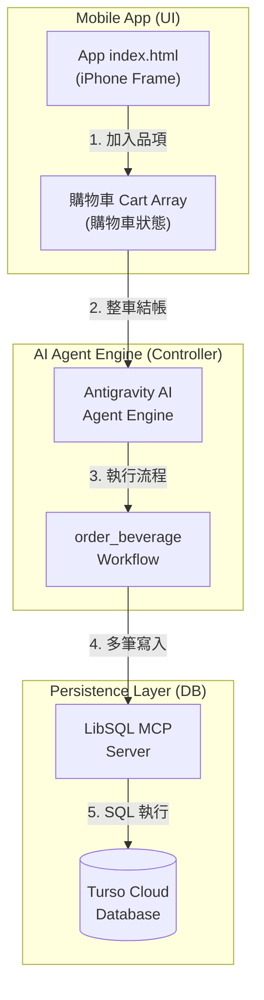

# CH07 · 天下茶屋：雲端資料持久化實作 (Turso & LibSQL)

本章節將引導你將「天下茶屋」點餐系統從純前端狀態，升級為具備 **購物車系統**、**雲端資料庫儲存** 與 **歷史紀錄查詢** 功能的行動商用架構。

---

### 🗺️ 系統架構圖 (Architecture)



### 🗺️ 課程實作流程 (Production Workflow)

```mermaid
flowchart TD
    %% 樣式定義
    classDef setup fill:#f3e8ff,stroke:#9333ea,stroke-width:2px,color:#4c1d95
    classDef frontend fill:#e0f2fe,stroke:#0284c7,stroke-width:2px,color:#0c4a6e
    classDef backend fill:#dcfce7,stroke:#16a34a,stroke-width:2px,color:#14532d
    classDef test fill:#ffedd5,stroke:#ea580c,stroke-width:2px,color:#7c2d12
    classDef user fill:#f1f5f9,stroke:#64748b,stroke-width:2px,stroke-dasharray: 5 5

    %% 節點定義
    Start([🚀 課程開始<br>CH07 雲端自動化]) --> Phase1
    
    subgraph Phase1 ["第一階段：環境與基礎建設"]
        direction TB
        A1[申請 Turso<br>雲端資料庫]:::setup --> A2[取得 DB URL<br>與 Auth Token]:::setup
        A2 --> A3[設定 mcp_config.json<br>整合中介軟體]:::setup
    end

    Phase1 --> Phase2

    subgraph Phase2 ["第二階段：前端自動化 (App 介面)"]
        direction TB
        B1((學生下達 Prompt<br>定義商業需求)):::user -.-> B2
        B2[設定 Agent 前端規範<br>引入 LibSQL SDK]:::frontend --> B3[引導 AI 實作 checkout.js<br>雲端結帳存檔邏輯]:::frontend
    end

    Phase2 --> Phase3

    subgraph Phase3 ["第三階段：代理人賦能 (Agent 技能)"]
        direction TB
        C1((學生下達 Prompt<br>定義資料結構)):::user -.-> C2
        C2[引導 AI 撰寫 db_storage_skill<br>實作 SQL 寫入邏輯]:::backend --> C3[引導 AI 更新 order_beverage<br>串接 S6 雲端存檔步驟]:::backend
        C3 --> C4[引導 AI 撰寫 db_query_skill<br>（進階）實作查帳功能]:::backend
    end

    Phase3 --> Phase4

    subgraph Phase4 ["第四階段：全機驗證 (驗收)"]
        direction TB
        D1[使用 App 進行<br>點餐確認結帳]:::test --> D2[與 AI 對話<br>要求查帳功能]:::test
        D2 --> D3[至 Turso 控制台<br>驗證資料寫入]:::test
    end

    Phase4 --> Finish([🎉 課程完成<br>天下茶屋全端架構])
```



---

# Part 1 · 核心理論：為什麼需要資料庫DataBase?

### 1.1 從 Local State 到 Cloud Persistence
在之前的章節中，訂單資料僅存在於 App 的記憶體中（Stateless）。具備持久化（Persistence）能力後，資料即使在系統重啟、跨裝置存取時也能保留，這才是真正的商業應用。

### 1.2 雲端資源管理與計費說明

Turso 提供 **Starter (Free) Plan**，其免費額度：
*   **讀取 (Read)**：10 億次/月
*   **寫入 (Write)**：2,500 萬次/月
*   **空間 (Storage)**：9 GB
只要不進行大規模的資料爬蟲或惡意攻擊，**日常教學與點餐測試不會產生任何費用**。

### 1.3 為什麼選擇 Turso (Edge SQLite)？

| 比較項目 | 傳統資料庫 (如 MySQL) | Turso (Edge SQLite) |
| :--- | :--- | :--- |
| **部署成本** | 需租用伺服器，自行安裝管理 | **零維運**，註冊即用，雲端全代管 |
| **學習曲線** | 架構複雜，需學習繁瑣權限設定 | **極簡單**，與常用的 SQLite 完全相容 |

---

# Part 2 · 雲端基礎設施建立 (Cloud Infrastructure)

## 2.1 建立 Turso 資料庫實例
1. **登入**：前往 [Turso 官網](https://turso.tech/)，點擊 **[Sign Up]** 並選擇 **[Continue with Google]**。
2. **建庫**：登入後在首頁點擊 **[Create Database]**，Name 填入 `tenka-tea-db`，Location 選預設即可，按 **[Create Database]** 完成。
3. **提取憑證**：
   - 進入剛建好的資料庫，點上方選項列的 **[Generate Token]** 按鈕。
   - 畫面會顯示兩段文字：
     - **Token（上方那段長字串）**：複製起來，這是 `TURSO_DB_TOKEN`。
     - **URL（下方 `libsql://` 開頭那行）**：複製起來，這是 `TURSO_DB_URL`。
   - ⚠️ **安全提醒**：Token 相當於資料庫的密碼，不要截圖分享或上傳到 GitHub。

## 2.2 環境變數組態 (.env)
在 `.env` 檔案中加入（原本的內容不動）：
```env
TURSO_DB_URL=貼上你的_URL
TURSO_DB_TOKEN=貼上你的_TOKEN
```

---

# Part 3 · 整合至MCP設定 (MCP Configuration)

找到專案根目錄下的 `mcp_config.json`（與 `.env` 同層），在 `"mcpServers"` 區塊內加入 `"database"` 這段設定。若原本已有 `weather`、`line` 等設定，**保留原內容，只新增 `database` 區塊**，完整範例如下：

```json
{
  "mcpServers": {
    "weather": {
      "command": "npx",
      "args": ["-y", "@mariox/weather-mcp-server"]
    },
    "line": {
      "command": "npx",
      "args": ["-y", "@line/line-bot-mcp-server"],
      "env": {
        "CHANNEL_ACCESS_TOKEN": "${env:LINE_CHANNEL_ACCESS_TOKEN}",
        "DESTINATION_USER_ID": "${env:DESTINATION_USER_ID}"
      }
    },
    "database": {
      "command": "npx",
       "args": ["-y", "@prama13/turso-mcp"],
      "env": {
        "TURSO_DATABASE_URL": "${env:TURSO_DB_URL}",
        "TURSO_AUTH_TOKEN": "${env:TURSO_DB_TOKEN}"
      }
    }
  }
}
```
>> 設定完成後，別忘了關掉 antigravity 再重開 (讓MCP Server重新啟動）
---

# Part 4 · 前端自動化整合 (Frontend Sync Implementation)

為了讓 App 能脫離開發環境獨立運作（例如打包成 APK 或 iOS App），前端必須具備直接與雲端資料庫通訊的能力。

### 步驟 4.1：升級 Agent 開發規範 (Agent Rules)

這份規則是給 AI 看的「工程師守則」。我們不需要自己查 SDK 版本，直接讓 AI 幫我們寫就好。

> **對 AI 的指令 (Prompt)：**
> 「請幫我在 `.agent/rules/` 目錄下建立 `frontend_rules.md`，規範如下：
> 1. 所有前端 HTML 頁面，必須在 `<head>` 區塊引入能連接 Turso 雲端資料庫的 LibSQL Web Client SDK（請選用穩定的 CDN 版本）。
> 2. 目的是確保前端具備直接寫入雲端資料庫的能力。
> 請幫我把這份規則寫成標準的 Markdown 格式，並存入正確的路徑。」

AI 建立完成後，你可以打開 `.agent/rules/frontend_rules.md` 確認檔案存在即可，不需要修改內容。

**接著請對 AI 下指令，讓它根據新規則更新前端：**
> 「你剛才幫我建立了前端開發規範。請根據這份規範檢查並更新我的 `index.html`，確保已正確引入 LibSQL SDK。」

### 步驟 4.2：引導 AI 實作 `checkout.js` 存檔邏輯
請對 AI 發送以下 Prompt，讓它幫你完成結帳自動化：

> **對 AI 的指令 (Prompt)：**
> 「我正在開發天下茶屋 App。請幫我優化 `checkout.js`，實作雲端存檔功能：
> 1. 業務需求：當使用者點擊結帳按鈕時，將目前的購物車資料同步存入 Turso 資料庫的 `orders` 表格中。
> 2. 資料對接：請確保提取購物車中的『訂單編號、品項名稱、數量、單價與小計』，並將這些資訊正確寫入資料庫對應的欄位。
> 3. 安全性：請確保包含必要的連線驗證 (Token)。
> 4. 實作細節：請根據我們專案目前使用的前端架構與 Turso 最佳實務，自行決定要用 SDK 還是 fetch API 來完成。」
> 
> ---
> 
> ### 💡 開發者筆記：為什麼指令可以這麼簡單？
> 你可能會問：**「我沒告訴 AI 要呼叫哪個 API、也沒給 SQL，它怎麼會寫？」**
> 這就是 Agentic 開發的威力：
> *   **上下文感知**：AI 知道你在前面步驟已經引入了 LibSQL SDK，也知道專案目錄裡有 `.env` 的設定。
> *   **自主決策**：AI 會根據「Turso 最佳實務」自行選擇用 `v2/pipeline` API 或 SDK 來實作，並自動處理參數對應與安全性。
> *   **角色反轉**：在這裡，你不是在教機器人寫程式，你是一位「產品總監 (PM)」，只需給定業務目標，技術細節由 AI 架構師來填補。

---

# Part 5 · AI 代理人持久化 (Agentic Persistence Setup)

除了前端直連，AI 代理人也需要被賦予「操作資料庫」的權限，這能讓 AI 在對話中主動幫學生查帳或修復錯誤。

### 步驟 5.1：引導 AI 建立雲端存檔技能 (db_storage_skill.md)
如同前端開發，AI 代理人的技能也應該由 AI 自己來撰寫。請對 AI 發送以下指令，讓它幫你生成技能檔：

> **對 AI 的指令 (Prompt)：**
> 「請幫我在 `.agent/skills/` 目錄下建立一個 `db_storage_skill.md`。
> 1. 業務目標：賦予你透過 Database MCP 將訂單資料存入 Turso 雲端的能力。
> 2. 資料結構要求：請設計 `orders` 表格的 Schema，必須包含 `order_id` (字串), `item_name` (字串), `qty` (整數), `unit_price` (整數), `subtotal` (整數)，以及自動產生的 `created_at` 時間戳記。
> 3. 實作規範：請在技能檔中寫明『若表格不存在則初始化表格』的 DDL，以及『寫入資料』的 SQL 邏輯，並確保參數映射正確。」

---

### 💡 開發者筆記：讓 AI 管理 AI
你有發現嗎？你剛才並不是自己在寫 SQL，而是 **「命令 AI 寫一份說明書給未來的 AI 看」**。這就是 Agent 代理人架構中最迷人的地方。只要資料結構 (Schema) 定義得夠清楚，底層的引號要怎麼標、參數要怎麼傳，AI 會處理得比我們還嚴謹。

### 步驟 5.2：引導 AI 升級訂餐流程 (order_beverage.md)
有了技能之後，我們需要將它整合進自動化點餐的 SOP 中。請繼續對 AI 發送以下指令，讓它幫你更新工作流：

> **對 AI 的指令 (Prompt)：**
> 「我們已經有了 `db_storage_skill` 技能。請幫我修改 `.agent/workflows/order_beverage.md` 流程檔：
> 1. 新增流程：在原本的 LINE 通知 (S5) 之後，加上一個全新的『S6: 雲端存檔 (Persistence)』階段。
> 2. 觸發條件：當訂單確認且結帳成功後執行。
> 3. 執行動作：呼叫 `db_storage_skill`，將本次交易的所有品項存至 Turso 雲端。
> 4. 使用者回饋：執行完畢後，請告訴使用者『您的訂單已安全存入雲端資料庫』。」

---

# Part 6 · 進階練習：歷史紀錄查詢 (Query System)

### 步驟 6.1：引導 AI 建立查詢技能 (db_query_skill.md)
同樣地，查帳技能也不需要我們自己手寫。請對 AI 發送以下指令：

> **對 AI 的指令 (Prompt)：**
> 「請幫我在 `.agent/skills/` 目錄下建立一個 `db_query_skill.md`。
> 1. 業務目標：賦予你『歷史紀錄查帳』的能力，能從 Turso 雲端抓取最近的訂單。
> 2. 實作規範：請定義一個能撈取 `"orders"` 表格中，依據 `"created_at"` 欄位遞減排序（最新在前），並限制前 10 筆紀錄的 SQL 查詢邏輯。
> 3. 工具整合：請在技能檔中寫明，執行此查詢時需呼叫 database MCP 伺服器。」

### 步驟 6.2：引導 AI 實作前端查詢介面
有了後端查詢技能後，我們接著讓 AI 把前端畫面也做出來：

> **對 AI 的指令 (Prompt)：**
> 「我已經請你配置好查詢技能了。現在請幫我修改 `index.html` 與 `checkout.js`：
> 1. 畫面需求：在結帳區塊下方新增一個『查看訂單歷史』的按鈕與列表區塊。
> 2. 互動邏輯：當點擊按鈕時，請透過專案的資料庫連線方式撈取最近 10 筆訂單資料。
> 3. 顯示格式：請將抓回來的資料以簡潔的卡片或條列方式顯示在畫面上。」

---

# Part 7 · 驗收成果

1. **App 測試**：在 App 中加入兩三種飲品到購物車，點擊「確認結帳」。
2. **AI 驗證**：問 AI「我剛剛買了什麼？幫我查資料庫」。
3. **雲端後台**：回到 Turso 控制台，點擊你資料庫旁邊的 **[Edit Data]** 按鈕，你應該能看到剛才結帳的品項已經整齊地躺在資料庫裡了！

### 🔧 看不到資料？先別慌，照這步驟排錯：

- **AI 回覆「沒有查詢權限」或「找不到表格」**：把完整的錯誤訊息複製後貼給 AI，說：「這是錯誤訊息，請幫我診斷並修復。」
- **Turso 後台是空的**：對 AI 說：「我結帳後資料庫沒有寫入資料，請幫我檢查 `checkout.js` 的寫入邏輯是否正確執行。」
- **結帳按了沒反應**：打開瀏覽器 DevTools（F12）→ Console，把紅色錯誤訊息截圖或複製給 AI 分析。

> 💡 記得：遇到問題時，把「錯誤訊息」交給 AI 就是最好的除錯起點。
