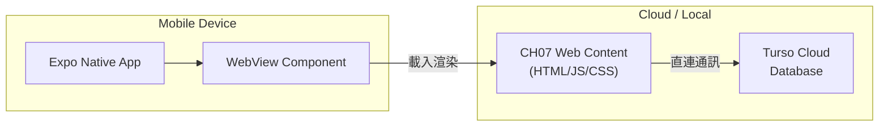

# CH08 · 天下茶屋：從網頁到 App 的跨越 (Expo & WebView)

本章節將引導你將「天下茶屋」智慧點餐網頁，包裝成一個真正的 **Android / iOS App**。我們將使用業界最流行的 **Expo** 框架來完成這個任務。

---

### 🗺️ 系統架構：App 包裝邏輯



---

# Part 1 · 環境準備 (Environment Setup)

在開始包裝之前，請先確認你的電腦環境是否就緒。

**開啟終端機**：在 VS Code 上方選單點擊 **[終端機] → [新增終端]**，後續所有指令都在這裡執行。

1. **確認 Node.js 已安裝**：輸入以下指令，若出現版本號（如 `v20.x.x`）即表示已安裝：
   ```bash
   node -v
   ```
   若顯示「找不到指令」，請前往 [Node.js 官網](https://nodejs.org/) 下載 **LTS** 版本安裝後再繼續。

2. **測試裝置**：依照你的情況選擇對應方式，**三種方式選一種即可**：

   | 情況 | 測試方式 | 需要安裝什麼 |
   | :--- | :--- | :--- |
   | 有實體手機（最推薦）| 手機安裝 **Expo Go**，掃 QR Code | 只需安裝 Expo Go App，免費 |
   | Windows + 已裝 Android Studio | Android 模擬器 | 已有 Android Studio，按 `a` 啟動 |
   | Mac + 已裝 Xcode | iOS 模擬器 | 已有 Xcode，按 `i` 啟動 |

   > 💡 **沒有安裝 Android Studio 或 Xcode 也完全沒關係**，用手機掃碼是最簡單、最快速的測試方式，Android 手機和 iPhone 都支援，課堂上直接用就好。
   >
   > ⚠️ **Windows 無法使用 iOS 模擬器**，若想看 iPhone 畫面效果，請用實體 iPhone 安裝 Expo Go 掃碼，效果完全相同。

---

# Part 2 · 建立 App 容器 (Initialization)

### 2.1 建立專案

在終端機確認目前位置是你的工作目錄（可輸入 `pwd` 查看路徑），接著執行：
```bash
npx create-expo-app@latest tenka-tea-app
```
這會在當前目錄下建立一個名為 `tenka-tea-app` 的新資料夾。

### 2.2 安裝 WebView 組件

進入剛才建立的專案資料夾，安裝用於顯示網頁的元件：
```bash
cd tenka-tea-app
npx expo install react-native-webview
```

---

# Part 3 · 部署 CH07 網頁到公開網址 (Deployment)

> ⚠️ **這是本章最重要的前置步驟。** Expo App 需要載入一個「公開的網路網址」，因此你必須先將 CH07 的網頁部署上線，才能繼續後面的步驟。

請對 AI 發送以下指令，讓它引導你完成部署：

> **對 AI 的指令 (Prompt)：**
> 「我的天下茶屋專案（CH07）已經開發完成，包含 `index.html`、`checkout.js` 與 `styles.css`。請引導我將這個靜態網頁部署到 Vercel，讓我取得一個公開的 HTTPS 網址，供後續的 Expo App 載入使用。」

部署完成後，你會取得一個類似 `https://tenka-tea-xxxx.vercel.app` 的網址，請把它記下來，下一步會用到。

---

# Part 4 · 核心程式碼實作 (Implementation)

開啟 `tenka-tea-app/App.js`（位於剛才建立的 Expo 專案**根目錄**），將檔案內所有內容**完整替換**為以下程式碼，並把第 5 行的網址改成你在 Part 3 取得的 Vercel 網址：

```javascript
import React from 'react';
import { StyleSheet, SafeAreaView, StatusBar } from 'react-native';
import { WebView } from 'react-native-webview';

export default function App() {
  // ↓ 將此處替換為你在 Part 3 取得的 Vercel 公開網址
  const WEB_URL = "https://你的專案網址.vercel.app";

  return (
    <SafeAreaView style={styles.container}>
      <StatusBar barStyle="dark-content" />
      <WebView
        source={{ uri: WEB_URL }}
        style={{ flex: 1 }}
        javaScriptEnabled={true}
        domStorageEnabled={true}
      />
    </SafeAreaView>
  );
}

const styles = StyleSheet.create({
  container: {
    flex: 1,
    backgroundColor: '#fff',
  },
});
```

---

# Part 5 · 真機測試與驗證 (Verification)

> 📶 **注意**：手機和電腦必須連接**同一個 WiFi 網路**，掃碼才能成功連線。

### 步驟一：啟動開發伺服器

在終端機（確認目前位置在 `tenka-tea-app` 資料夾內）執行：
```bash
npx expo start
```
終端機畫面會出現一個 QR Code 及選項選單，保持此視窗開著不要關閉。

---

### 步驟二：用手機連線（依手機系統選擇）

#### Android 手機

1. 在 Google Play 搜尋並安裝 **Expo Go**。
2. 打開 **Expo Go**，點擊首頁的 **[Scan QR code]**。
3. 對準電腦螢幕上的 QR Code 掃描。
4. 掃描成功後，手機會自動載入 App 畫面（首次載入約需 10–30 秒）。

> ⚠️ 若掃碼後一直轉圈無法載入，請確認手機和電腦是否連同一個 WiFi。

---

#### iPhone

1. 在 App Store 搜尋並安裝 **Expo Go**。
2. 打開手機內建的**相機 App**（不是 Expo Go）。
3. 對準電腦螢幕上的 QR Code，畫面上方會出現跳出通知。
4. 點擊通知，手機會自動跳轉至 **Expo Go** 並載入 App 畫面。

> 💡 iPhone 不需要在 Expo Go 裡掃碼，直接用相機掃即可，系統會自動導向。

---

### 步驟三：驗收點餐

- 在手機 App 上選取飲品。
- 點擊「同步雲端並支付」（這是你在 CH07 實作的結帳按鈕）。
- **檢查 Turso 後台**：即使是用手機 App 下單，資料依然會正確存入雲端！

---

# Part 6 · 邁向 Google Play / App Store 的最後一步

當你完成上述測試，請對 AI 發送以下指令，讓它幫你準備上架所需的設定：

> **對 AI 的指令 (Prompt)：**
> 「我已經完成 Expo 的 WebView 配置，請幫我生成 `app.json` 的設定，包含 App 的圖示 (Icon)、啟動畫面 (Splash Screen) 以及針對 Android Store 上架所需的包名 (Package Name) 以及 iOS Store 所需的 Bundle Identifier 設定。」

---

# Part 7 · iOS 與 Android 的發佈差異 (Special Note)

雖然程式碼相同，但上架流程有以下不同：

| 項目 | Android (Google Play) | iOS (Apple App Store) |
| :--- | :--- | :--- |
| **必備帳號** | Google Play Developer | Apple Developer Program |
| **識別碼格式** | `package`: `com.tenka.app` | `bundleIdentifier`: `com.tenka.app` |
| **編譯工具** | Windows/Mac 皆可 | 建議使用 Expo EAS Build (雲端編譯) |
| **審核時間** | 約 1-3 天 | 約 1-5 天 (較嚴格) |

### 💡 沒有 Mac 電腦也沒關係！
如果你用的是 Windows，請學習使用 **Expo EAS（Expo Application Services）**。它能讓你透過 Expo 的雲端伺服器幫你打包出 iOS 的 `.ipa` 安裝檔，完全不需要 Mac 電腦！

### 💡 為什麼不需要重寫所有程式碼？
這正是「Web-Based Hybrid App」的開發優勢：你在 CH07 寫好的所有前端邏輯，直接透過 WebView 沿用到 App 裡，以最低成本達成跨平台佈署。

### 💡 安全性提醒
將網址放入 `App.js` 之前，請確認你的 Vercel 網址是 `https://` 開頭（有加密）。Vercel 部署的網址預設都已包含 HTTPS，不需要額外設定。
